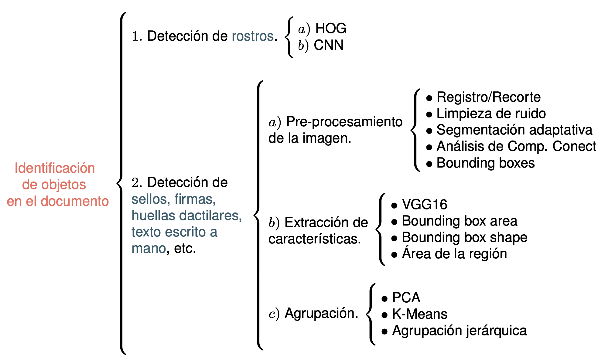
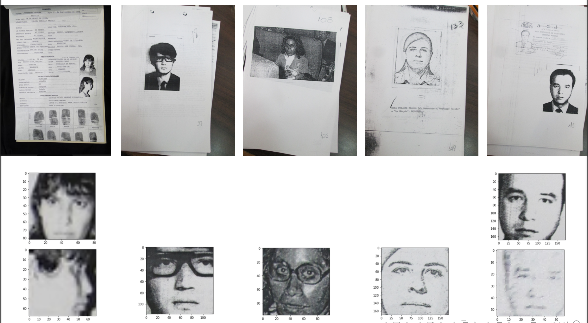
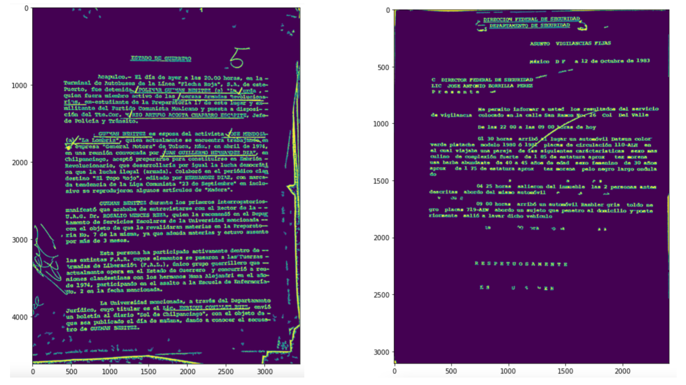
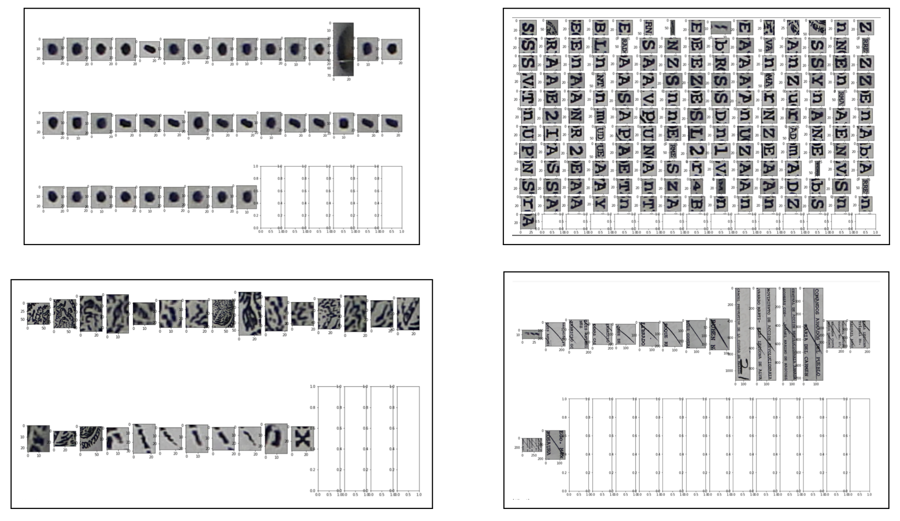
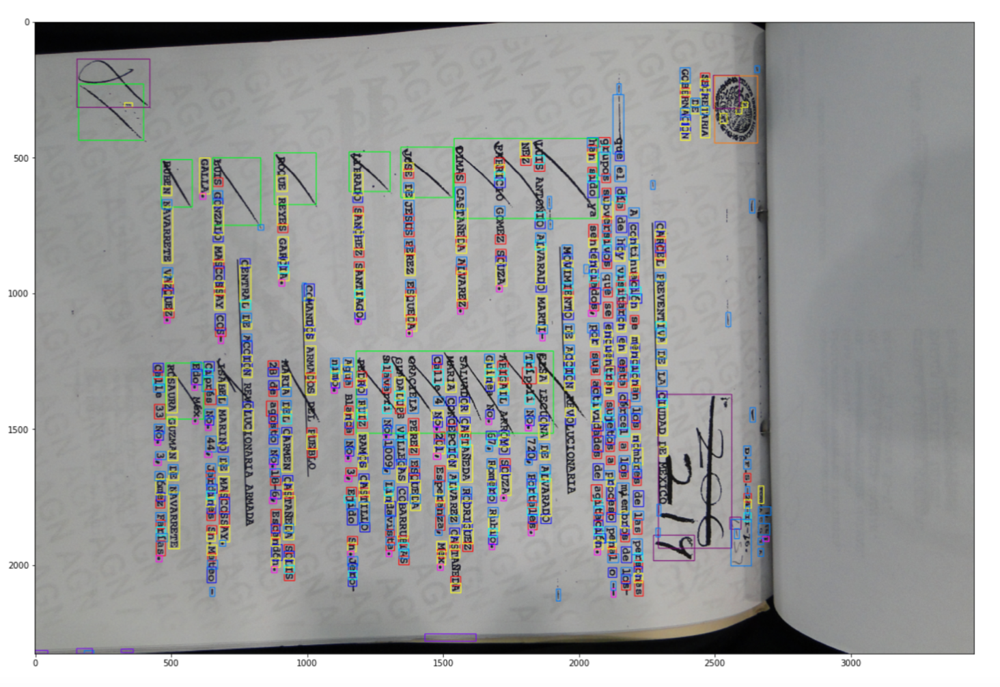
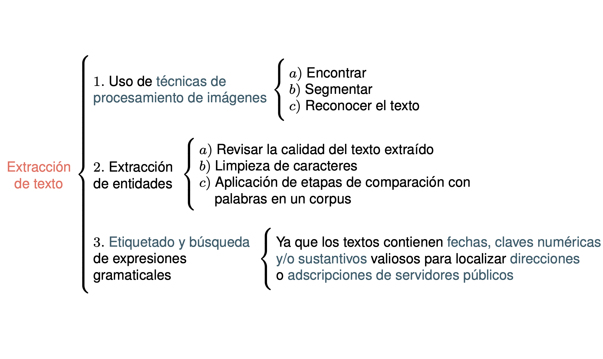
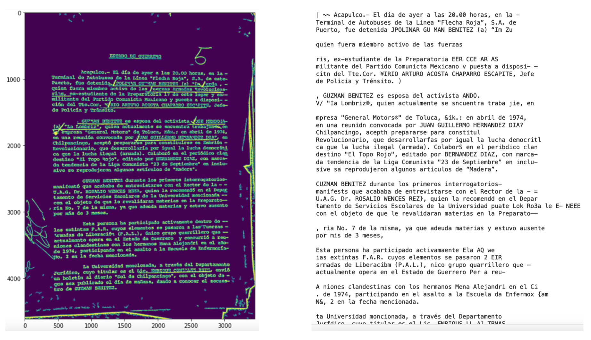
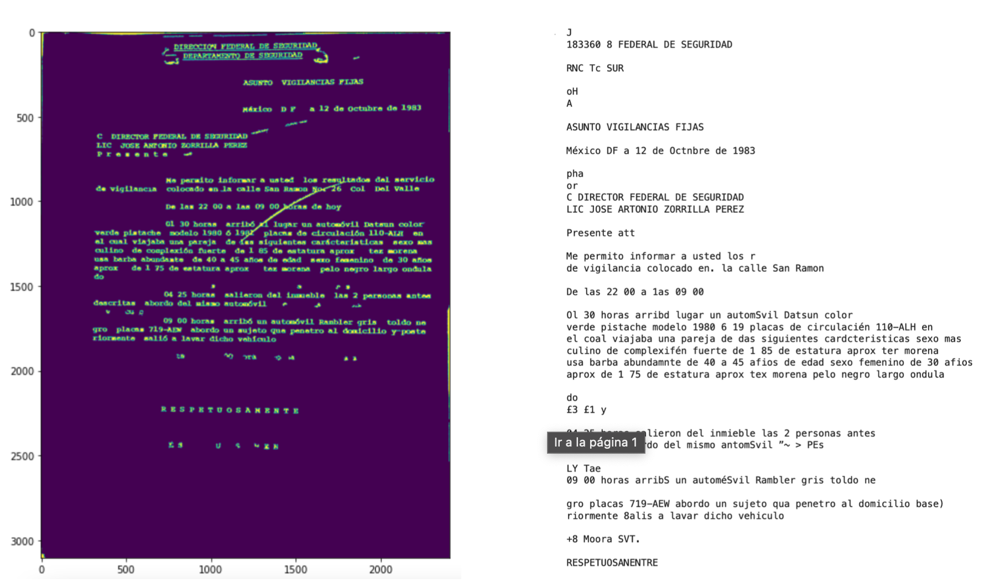

# Hackathon RIIAA 2021 "JusticIA para los desaparecidos"

La desaparición forzada de personas es una violación grave a los derechos humanos. Entre 1964 y 1985 (Guerra sucia) el Estado mexicano se enfrentó y reprimió ferozmente a movimientos sociales, líderes de organizaciones político-militares, simpatizantes, familias y comunidades que consideraba como enemigos. Esclarecer el paradero de las víctimas, que hasta el día de hoy continúan desaparecidas, implica la integración y estructuración de la información contenida en miles de archivos institucionales que han sido digitalizados como imágenes. En esta plática se presentarán propuestas de soluciones basadas en Inteligencia Artificial (IA) para el análisis, clasificación y extracción de información de miles de imágenes de documentos de la represión. Esto como parte de los resultados obtenidos en el 1er Hackathon 2021 “Justicia para los desaparecidos” organizado por la  Reunión Internacional de Inteligencia Artificial y sus Aplicaciones (RIIAA). Entre  las actividades que se realizaron  está la detección y extracción de texto de las imágenes, el reconocimiento de caracteres y su semantización, el reconocimiento facial de personas, reconocimiento de firmas y sellos en los documentos. Algunas herramientas utilizadas son el aprendizaje profundo, clustering, visión computacional y procesamiento de lenguaje natural.

## Team:
**Pista Latente ML**

- Andrea Ek
- Gabriela Mundo
- Xavier Canche
- Myrna Castillo
- Ramón Aparicio

# Solution for Challenge 1.
**Pipeline:**

**Face recognition:**
Use lib face_recognition with Convolutional Neural Netwok.  

**Segmentation:**
Segmentation with image processing.  

**Clustering:**
Feature extract with Deep Neural Network VGG16 and clustering with K-means and agglomerative hierarchical clustering.  

**Results:**

# Solution for Challenge 2.
**Pipeline:**

**Text Segmentation:**
We use same segmentation of challenge 1. 

**Text Recognition:**
We use pytesseract for text recognition on text segmentation.  

**Reference:**
- https://github.com/Hackaton-JusticIA-2021/pista-latente-ML-sol
- https://riiaa.org/
- https://archivosdelarepresion.org/
- https://www.eventbrite.com/e/riiaa-2021-hackathon-justicia-para-los-desaparecidos-tickets-163293237469
- https://www.entrepreneur.com/article/379973

